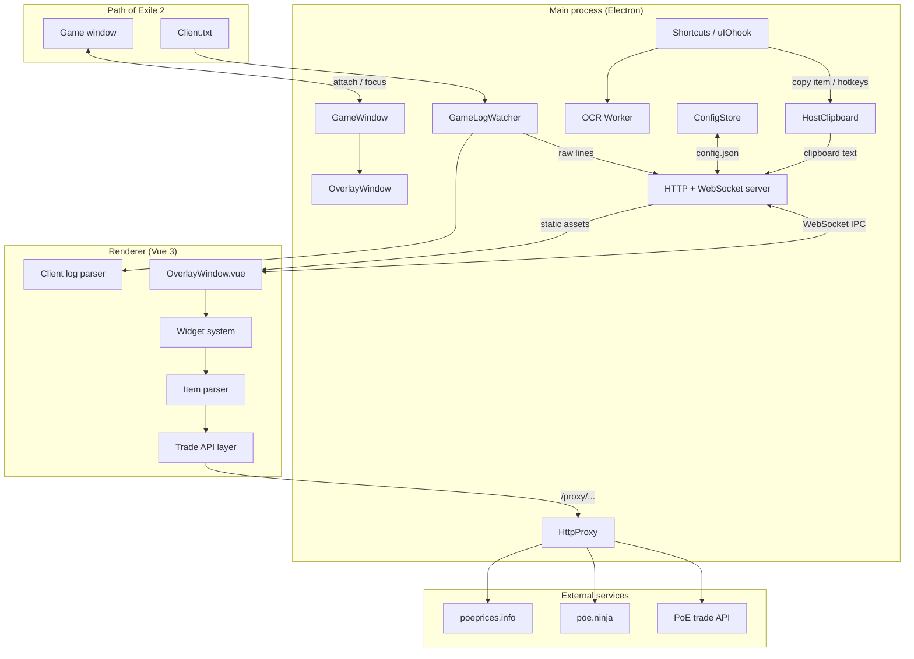

# Architecture

Exiled Exchange 2 (EE2) is a desktop overlay for Path of Exile 2. It attaches a transparent Electron window on top of the game, captures item text from the clipboard, parses it, and queries official and third-party trade APIs. The project is a fork of [Awakened PoE Trade](https://github.com/SnosMe/awakened-poe-trade), adapted for PoE2.

This document describes how the system is structured, how the major components interact, and where to look in the codebase.

## High-level overview

EE2 is split into three cooperating parts:

| Part | Location | Role |
| ---- | -------- | ---- |
| **Main process** | `main/` | Electron host: overlay attachment, global hotkeys, clipboard, game log tailing, HTTP server, auto-update |
| **Renderer** | `renderer/` | Vue 3 UI: widgets, item parser, trade queries, settings |
| **Data builder** | `dataParser/` | Python pipeline that generates static game/trade data shipped with the app |

The main and renderer processes communicate over a local HTTP server and WebSocket event bus. In production, the renderer is bundled into `renderer/dist/` and served by the main process. In development, Vite serves the renderer while the main process connects to it.



## Repository layout

```
Exiled-Exchange-2/
├── main/                 # Electron main process
│   └── src/
│       ├── main.ts       # App entry, bootstraps all host services
│       ├── server.ts     # HTTP server, WebSocket IPC bus
│       ├── shortcuts/    # Global hotkeys, clipboard, chat macros
│       ├── windowing/    # Overlay + game window attachment
│       ├── host-files/   # Config, game log, file output
│       ├── vision/       # OCR worker (Heist gems, etc.)
│       └── proxy.ts      # Outbound HTTP proxy for trade APIs
├── renderer/             # Vue 3 frontend
│   └── src/
│       ├── main.ts       # Vue bootstrap
│       ├── parser/       # Clipboard item text → ParsedItem
│       ├── assets/data/  # Runtime indexes over bundled ndjson
│       └── web/
│           ├── overlay/  # Widget shell and registry
│           ├── price-check/
│           ├── client-log/
│           └── background/  # IPC, leagues, prices
├── ipc/                  # Shared TypeScript types (main ↔ renderer)
├── dataParser/           # Python data generation pipeline
└── docs/                 # VitePress user + developer documentation
```

Shared types in `ipc/types.ts` and `ipc/KeyToCode.ts` are imported by both `main/` and `renderer/` so the IPC contract stays type-safe on both sides.

## Main process

Entry point: `main/src/main.ts`.

### Startup sequence

1. **Single instance lock** — a second launch exits immediately.
2. **Sandbox & platform tweaks** — hardware acceleration is disabled on non-macOS; sandbox is enabled.
3. **macOS accessibility** — global hotkeys require accessibility permission; the app waits up to 15 seconds for the user to grant it.
4. **Service initialization** (on `app.ready`):
   - `AppTray` — system tray icon and menu
   - `Logger` — in-memory log buffer forwarded to renderer
   - `GameConfig` — locates and parses PoE `poe2_production_Config.ini` (show-mods key; path set later via host config)
   - `GameWindow` — tracks whether the game is focused
   - `AppUpdater` — electron-updater integration
   - `HttpProxy` — registers `/proxy/` routes on the HTTP server
   - `FileWriter` — CSV / ndjson output for experimental features
   - `GameLogWatcher` — discovers and tails `Client.txt`
5. **Deferred overlay** (1 s delay on Linux for transparent-window fix):
   - `OverlayWindow` — creates the transparent BrowserWindow
   - `OverlayVisibility` — shows/hides overlay based on game focus
   - `Shortcuts` — registers user hotkeys via Electron `globalShortcut`
   - `uIOhook.start()` — starts low-level keyboard/mouse hooks
   - `startServer()` — binds HTTP + WebSocket
   - `overlay.loadAppPage(port)` — loads the renderer URL

### HTTP and WebSocket server

`main/src/server.ts` creates a single Node `http.Server` that handles:

| Route | Purpose |
| ----- | ------- |
| `/` and static paths | Serves `renderer/dist/` in production |
| `/config` | Returns app version, updater state, and `config.json` contents |
| `/events` (WebSocket upgrade) | Bidirectional IPC event bus |
| `/uploads/:name` | File upload endpoint for settings import |
| `/proxy/:host/...` | Proxied outbound HTTP (see below) |

In development, `VITE_DEV_SERVER_URL` points the overlay at the Vite dev server (port 5173 by default). The WebSocket server still listens on port **8584** so IPC works across origins.

In production, the server binds `127.0.0.1` on an **ephemeral port** (`port: 0`) unless `--listen=[host][:port]` is passed. Use a fixed port (e.g. `--listen=127.0.0.1:8584`) when running with `--no-overlay` and bookmarking the browser UI.

### WebSocket IPC protocol

The event bus (`eventPipe`) dispatches typed events defined in `ipc/types.ts`.

**Wire format** — clients send JSON messages:

```json
{ "name": "CLIENT->MAIN::save-config", "payload": { "contents": "...", "isTemporary": false } }
```

The server parses `name` and `payload`, then emits on an internal `EventEmitter`. Outbound events use the same shape.

**Delivery targets** (`sendEventTo`):

| Target | Behavior |
| ------ | -------- |
| `last-active` | Most recently active WebSocket client (overlay or browser tab) |
| `broadcast` | All connected clients |

The renderer marks itself active via `CLIENT->MAIN::used-recently`, which updates the `last-active` target. Multiple clients can connect (overlay + browser in `--no-overlay` mode); config changes broadcast to all via `MAIN->CLIENT::config-changed`.

### Overlay and game window

**`GameWindow`** (`main/src/windowing/GameWindow.ts`) wraps `electron-overlay-window`. It attaches the overlay `BrowserWindow` to the PoE window by title (configurable, default `"Path of Exile 2"`) and emits `active-change` when focus moves between game and overlay.

**`OverlayWindow`** (`main/src/windowing/OverlayWindow.ts`) manages interactability:

- **Overlay key** (default `Shift + Space`) toggles between "click-through to game" and "interact with overlay UI". Handled via `before-input-event` on the overlay `BrowserWindow`, not `globalShortcut`.
- `OVERLAY->MAIN::focus-game` returns focus to the game.
- `OverlayVisibility` hides the overlay when the game is unfocused (unless a widget requests otherwise).

Pass `--no-overlay` to skip creating the overlay window entirely; the app then opens in a normal browser tab (useful on Linux).

### Input systems

EE2 uses three separate input mechanisms:

| Mechanism | Where | Purpose |
| --------- | ----- | ------- |
| **Electron `globalShortcut`** | `Shortcuts.register()` | User-configured hotkeys (`copy-item`, `toggle-overlay`, etc.) while the **game window is focused**; unregistered on blur |
| **uiohook-napi** | `Shortcuts`, `WidgetAreaTracker` | Simulated key presses for clipboard copy, stash scroll (Ctrl+wheel), mouse area tracking, optional key logging |
| **`before-input-event`** | `OverlayWindow` | Default overlay key (`Shift + Space`), Escape, Ctrl+W — works on the overlay window regardless of game focus state |

Do not conflate the **overlay key** (Settings → General) with the **`toggle-overlay` shortcut action** (Settings → Shortcuts). Both toggle interactability, but through different code paths.

### Shortcuts and input

**`Shortcuts`** (`main/src/shortcuts/Shortcuts.ts`) is the user-hotkey hub:

- Registers **`ShortcutAction[]`** from host config via `globalShortcut` while the game is focused.
- Uses **uiohook-napi** to release held keys, simulate `Ctrl+C` (+ show-mods key), and drive `WidgetAreaTracker`.
- Reads config pushed by the renderer on startup and on `CLIENT->MAIN::update-host-config`.

Supported action types (see `ipc/types.ts` → `ShortcutAction`):

| Action | Behavior |
| ------ | -------- |
| `copy-item` | Simulates Ctrl+C, reads clipboard, sends `MAIN->CLIENT::item-text` |
| `ocr-text` | Screenshots game area, runs OCR worker, sends `MAIN->CLIENT::ocr-text` (**Windows only** for `heist-gems`) |
| `trigger-event` | Sends `MAIN->CLIENT::widget-action` to open a widget |
| `stash-search` | Types a search string into the in-game stash UI |
| `toggle-overlay` | Toggles overlay interactability |
| `paste-in-chat` | Types and optionally sends a chat macro |

`HostClipboard` preserves and restores clipboard contents when `restoreClipboard` is enabled. `WidgetAreaTracker` maps overlay widget regions to screen coordinates for area-sensitive hotkeys. For **stash scroll** (Ctrl+wheel), `Shortcuts.isStashArea()` uses the game window bounds and an estimated left-panel width — more precise than the renderer's screen-center heuristic used for price-panel placement (see [Item capture](/item-capture#stash-vs-inventory-heuristic)).

### Host files and persistence

| Module | Path | Role |
| ------ | ---- | ---- |
| `ConfigStore` | `%APPDATA%/exiled-exchange-2/apt-data/config.json` (platform-specific `userData`) | Loads/saves renderer config |
| `GameLogWatcher` | Tails `Client.txt` | Discovers log path, streams new lines as `MAIN->CLIENT::game-log` |
| `GameConfig` | Reads PoE `poe2_production_Config.ini` | Parses `show_advanced_item_descriptions` hotkey for clipboard copy |
| `FileWriter` | User-configurable output dir | Writes item-roll CSV and client-log ndjson |

Config is saved when the renderer sends `CLIENT->MAIN::save-config`. A temporary save (`.tmp` suffix) is used when the config JSON is corrupt on first load.

### Vision / OCR

`main/src/vision/` runs OCR in a **worker thread** via Comlink. Language packs live under `userData/apt-data/cv-ocr/`. The primary use case is **Heist gem detection** (`ocr-text` → `heist-gems` target). OCR is **Windows-only** today (`Shortcuts.ts` and `wasm-bindings.ts` guard on `win32`).

### HTTP proxy

Trade and price APIs cannot be called directly from the renderer due to CORS and cookie requirements. Instead, `renderer` calls `Host.proxy(url)` which fetches `/proxy/<host>/<path>`.

`main/src/proxy.ts` whitelists hosts:

- Official PoE trade sites (`www.pathofexile.com`, regional mirrors)
- `poe.ninja`, `www.poeprices.info`
- `api.exiledexchange2.dev`

Only listed hosts are forwarded. The proxy strips browser-specific headers and uses Electron's `net.request` with session cookies so PoE login state applies.

### Trade authentication (built-in browser)

The renderer cannot call PoE trade APIs directly (CORS). Authenticated requests rely on **session cookies** from an official PoE domain, shared into the main-process proxy via Electron's default session.

Flow:

1. User opens the **built-in browser** (`<webview>` in `PriceCheckWindow.vue`) from trade listings, league info, or sign-in prompts.
2. User logs in on `pathofexile.com` (or a regional mirror) inside that webview.
3. Subsequent `Host.proxy()` calls from the renderer include those cookies; the main process forwards them to the trade API.

If price checks return **401/403**, log in via the built-in browser first. Cookies persist in the Electron session until cleared. This is separate from item capture (clipboard) — only trade queries need login.

### Auto-update

`AppUpdater` wraps `electron-updater`. State changes are broadcast as `MAIN->CLIENT::updater-state`. Disable with `--no-updates`.

## Renderer process

Entry point: `renderer/src/main.ts`.

### Bootstrap

1. `initConfig()` — loads config from `/config`, sets up `MAIN->CLIENT::config-changed` listener
2. `I18n.init()` — vue-i18n for UI strings (`public/data/<lang>/app_i18n.json`)
3. `Data.init()` — builds in-memory indexes from bundled ndjson + `client_strings.js`
4. `Host.init()` — opens WebSocket to `/events`
5. Mounts `App.vue` → `OverlayWindow.vue`

Language changes trigger reload of data indexes and i18n strings.

### Configuration model

`renderer/src/web/Config.ts` holds a reactive `Config` object containing:

- Global settings (language, league, overlay key, window title, hotkeys, etc.)
- A `widgets[]` array — one entry per widget instance

`pushHostConfig()` sends a `HostConfig` subset to the main process whenever host-relevant settings change. `saveConfig()` persists the full config JSON to disk via IPC.

### Widget system

Widgets are the primary UI abstraction. Each feature (price check, map check, stash search, etc.) registers a Vue component with an attached `widget` spec in `renderer/src/web/overlay/widget-registry.ts`.

**Widget lifecycle fields** (`renderer/src/web/overlay/widgets.ts`):

| Field | Meaning |
| ----- | ------- |
| `wmId` | Unique instance id |
| `wmType` | Registry lookup key (e.g. `"price-check"`) |
| `wmWants` | `"show"` or `"hide"` — desired visibility |
| `wmZorder` | Stacking order; `"exclusive"` blocks other widgets |
| `wmFlags` | Behavioral flags (`hide-on-blur`, `has-browser`, etc.) |

`OverlayWindow.vue` iterates `AppConfig().widgets`, resolves components from the registry, and manages focus/visibility based on game state and flags.

Core widgets include: menu, settings, price check, item check/info, map check, stash search, item search, XP tracker, stopwatch, image strip, delve grid, notepad, and library (item data collection).

### IPC client

`renderer/src/web/background/IPC.ts` (`Host` / `MainProcess`) wraps a Sockette WebSocket client:

- Dispatches incoming events on a local `EventTarget`
- `sendEvent()` posts to the server
- `getConfig()` fetches initial host state
- `proxy()` wraps `fetch` through the main-process proxy

In a plain browser (no Electron user agent), `MAIN->OVERLAY::*` events are ignored.

### Item parser

`renderer/src/parser/Parser.ts` converts clipboard item text into a `ParsedItem`:

1. Split text into sections (header, properties, requirements, modifiers, etc.)
2. Run a pipeline of section parsers (rarity, base type, item level, sockets, influences, etc.)
3. Resolve base types and stats against bundled `items.ndjson` / `stats.ndjson`
4. Apply stat translation via `client_strings.js` matchers
5. Calculate derived values (quality, armour/evasion thresholds, etc.)

The parser uses [neverthrow](https://github.com/supermacro/neverthrow) `Result` types for explicit error handling. Modifier grouping and tier detection live in `advanced-mod-desc.ts` and `modifiers.ts`.

### Trade integration

Price check flows through:

1. **Filters** — `create-item-filters.ts` / `create-stat-filters.ts` build PoE trade API query objects from `ParsedItem`
2. **API** — `pathofexile-trade.ts` posts to `/api/trade2/search/{leagueId}` and `/api/trade2/fetch/...` via the proxy (`leagueId` is the active league slug from the trade API). Web UI links shown to users use `/trade2/search/poe2/{league}/...` — that `poe2` segment is for the website, not the search API path.
3. **Rate limiting** — `RateLimiter.ts` respects PoE API headers
4. **Bulk exchange** — `bulk-api.ts` / `pathofexile-bulk.ts` for currency exchange rates
5. **Third-party pricing** — `Prices.ts` (poe.ninja), `poeprices.ts` (poeprices.info)

League list is refreshed from the trade API in `background/Leagues.ts`.

### Client log pipeline

When `readClientLog` is enabled:

1. `GameLogWatcher` reads new bytes from `Client.txt`
2. Raw lines arrive as `MAIN->CLIENT::game-log`
3. `client-log-parser.ts` parses lines into typed `ClientLogEvent` objects
4. Events can be written to ndjson via `FileWriter` for external tooling

See [Client Log Parser](/client-log-parser) for the event schema.

## Static data layer

### Bundled assets

Under `renderer/public/data/<lang>/`:

| File | Contents |
| ---- | -------- |
| `items.ndjson` | Base types, uniques, gems — one JSON object per line |
| `stats.ndjson` | Trade stat definitions and matchers |
| `client_strings.js` | PoE client string templates for stat translation |
| `app_i18n.json` | UI translations |

`renderer/src/assets/data/index.ts` loads ndjson at startup and builds sorted binary-search indexes (via `make-index-files.mjs`) for fast lookup by ref, translated name, and stat match string.

### Data builder (`dataParser/`)

Python pipeline (`dataParser/src/main.py`) that:

1. Optionally **pulls** fresh exports from the PoE game API and trade API
2. For each language, builds `stats.ndjson`, `items.ndjson`, and `client_strings.js`
3. Optionally **pushes** output into `renderer/public/data/`

Run from the `dataParser/` directory:

```bash
python ./src/main.py --help
```

See [Development](/development#data-pipeline) for workflow details.

## IPC event reference

Events are defined in `ipc/types.ts`. Direction indicates typical flow.

### Overlay-only

| Event | Direction | Purpose |
| ----- | --------- | ------- |
| `MAIN->OVERLAY::overlay-attached` | → renderer | Game window attach succeeded |
| `MAIN->OVERLAY::focus-change` | → renderer | Game/overlay focus state |
| `MAIN->OVERLAY::visibility` | → renderer | Show/hide overlay |
| `MAIN->OVERLAY::hide-exclusive-widget` | → renderer | Close exclusive widget |
| `OVERLAY->MAIN::focus-game` | ← renderer | Return focus to game |
| `OVERLAY->MAIN::track-area` | ← renderer | Register screen area for hotkey targeting |

### Shared (main ↔ any client)

| Event | Direction | Purpose |
| ----- | --------- | ------- |
| `CLIENT->MAIN::update-host-config` | ← renderer | Push hotkeys, log path, overlay settings |
| `CLIENT->MAIN::save-config` | ← renderer | Persist config JSON |
| `MAIN->CLIENT::config-changed` | → renderer | Config updated (multi-client sync) |
| `CLIENT->MAIN::used-recently` | ← renderer | Track active WebSocket client |
| `MAIN->CLIENT::log-entry` | → renderer | Stream logger output |
| `MAIN->CLIENT::updater-state` | → renderer | Auto-update state |
| `MAIN->CLIENT::widget-action` | → renderer | Open widget by target name |
| `MAIN->CLIENT::item-text` | → renderer | Clipboard item text + cursor position |
| `MAIN->CLIENT::ocr-text` | → renderer | OCR result paragraphs |
| `MAIN->CLIENT::game-log` | → renderer | Raw Client.txt lines |
| `CLIENT->MAIN::re-parse-log` | ← renderer | Re-read Client.txt from start |
| `CLIENT->MAIN::user-action` | ← renderer | Quit, update, stash-search |
| `CLIENT->MAIN::write-data` | ← renderer | CSV / ndjson file output |

## Security and trust boundaries

- **Local-only server** — binds `127.0.0.1` by default; use `--listen=0.0.0.0` only if needed (e.g. VPN issues).
- **Proxy whitelist** — only approved hosts are forwarded; arbitrary URLs are rejected.
- **File uploads** — `/uploads/:name` accepts settings imports from connected clients only; it is not exposed beyond the local server.
- **Sandbox** — Electron sandbox is enabled for renderer web preferences.
- **No remote code execution** — updates come from GitHub releases via electron-updater.
- **Clipboard access** — item text is read only when the user triggers a price-check hotkey.

## Build and release

Local builds use **Node.js 24.x** and **Electron ~40.x** (see `main/package.json`). Native addons (`uiohook-napi`, `electron-overlay-window`) compile against Electron's ABI, not system Node.

CI (`.github/workflows/main.yml`):

1. **renderer job** (Ubuntu) — `npm ci`, `make-index-files`, lint, `vite build` → artifact
2. **package job** (Windows, Ubuntu 22.04, macOS) — download renderer dist, build main, `electron-builder package`

Pushes that only change `docs/**` or `README.md` do **not** trigger the app build workflow. Doc-only changes deploy separately via `.github/workflows/pages.yml`.

Linux releases are packaged as an **AppImage** (`main/electron-builder.yml`). See [Building for Linux](/building-linux) for local Linux builds and [Development → Building for production](/development#building-for-production) for the canonical build commands.

Tests (`.github/workflows/test.yml`) run pre-commit hooks and Vitest in `renderer/specs/`. The `dataParser/` package has its own pytest suite under `dataParser/tests/`.

Release versioning is driven by `main/package.json`. CI builds installers on every **`master` push**; tag pushes do **not** trigger CI (`tags-ignore` in the workflow). Packaging uses electron-builder's `onTagOrDraft` mode — artifacts upload to an existing **GitHub draft release or tag** matching the version. See [Development → Release process](/development#release-process) for the maintainer checklist.

## Cross-platform notes

| Platform | Considerations |
| -------- | -------------- |
| **Windows** | Primary target; full overlay and hotkey support |
| **Linux** | 1 s startup delay for transparent overlay; Wine/Steam paths for `Client.txt`; `--no-overlay` for browser-only use |
| **macOS** | Requires accessibility permission; overlay uses `hasTitleBarOnMac` |

## Related documentation

- [Item capture from game](/item-capture) — hotkey → clipboard → overlay display pipeline
- [Development guide](/development) — setup, testing, contributing
- [Client Log Parser](/client-log-parser) — log event schema
- [Item data](/item-data) — experimental crafting data collection
- [Command-line options](/cmd-flags) — runtime flags
- [DEVELOPING.md](https://github.com/Kvan7/Exiled-Exchange-2/blob/master/DEVELOPING.md) — short overview in the repository root
