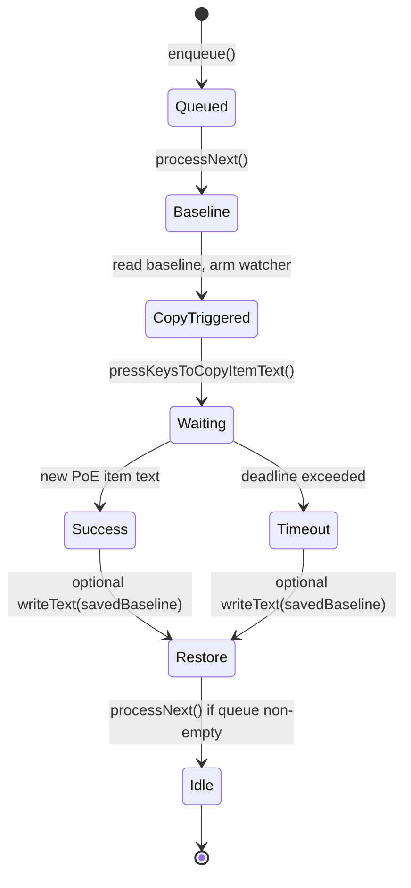

# Capture session model

Core redesign: treat each price-check hotkey as a **CaptureSession** processed by a **CaptureQueue**, with a **generation counter** and strict rules about when the OS clipboard may be written.

## Serialized capture queue

### Problem

Today, overlapping `readItemText()` calls share one `pollPromise`. Two hotkeys → one clipboard result, two cursor positions.

### Solution

```ts
// main/src/shortcuts/CaptureQueue.ts (new)

interface CaptureRequest {
  action: CopyItemAction; // from ipc/types ShortcutAction
  position: { x: number; y: number };
  keepModKeys?: string[];
  showModsKey: string;
}

interface CaptureResult {
  generation: number;
  clipboard: string;
  request: CaptureRequest;
}

class CaptureQueue {
  private queue: CaptureRequest[] = [];
  private activeGeneration = 0;
  private running = false;

  enqueue(request: CaptureRequest): Promise<CaptureResult>;
  private processNext(): Promise<void>;
}
```

### Rules

1. **FIFO** — hotkeys processed in order.
2. **At most one active session** — next request starts only after previous session settles (resolve or reject).
3. **Optional queue cap** — e.g. max 3 pending; drop oldest or coalesce (document choice in implementation; default: cap at 5, drop oldest with debug log).
4. **`Shortcuts.ts` responsibility** — on `copy-item`, call `captureQueue.enqueue(...)` instead of `readItemText()` directly; move `pressKeysToCopyItemText` **inside** the session after baseline is recorded.

### User-visible behavior change

Rapid spam queues checks sequentially. Each check may take up to ~500 ms, so a burst of 3 hotkeys could take ~1.5 s total. This is **intentional** — correct item + cursor pairing beats instant wrong results.

Consider showing queue depth in debug logs only (no UI in v1).

---

## Generation counter

### Problem

Async clipboard reads, simulated key release timeouts (10 ms in `pressKeysToCopyItemText`), and future event-driven callbacks can deliver results **after** a session has ended.

### Solution

Monotonic `generation` assigned when a session **starts**:

```ts
let globalGeneration = 0;

function beginSession(): number {
  return ++globalGeneration;
}

function isCurrentSession(generation: number): boolean {
  return generation === globalGeneration;
}
```

Every async continuation checks `isCurrentSession(gen)` before:

- Resolving with clipboard text
- Sending `MAIN->CLIENT::item-text`
- Writing restore text to OS clipboard

Stale results log:

```text
debug [CaptureSession] stale result ignored generation=3 current=4
```

### IPC (optional debug field)

Extend `IpcItemText` payload with optional `captureGeneration?: number` for log correlation. Renderer ignores it in v1.

---

## Defer clear

### Problem

Clearing PoE item text **at session start** (`writeText("")`) fights clipboard managers that repopulate on empty clipboard, and can race with history sync.

### Solution

**Do not clear at session start.** Instead:

| Step | Clipboard write? |
| ---- | ---------------- |
| 1. Session starts | **No** — read `baseline = clipboard.readText()` only |
| 2. Arm watcher with `baseline` | **No** |
| 3. Immediately before simulated copy | **Conditional clear** (see below) |
| 4. Wait for new PoE text | **No** |
| 5. Session success / failure cleanup | Restore only (if setting enabled) |

### Conditional clear (narrow window)

Immediately before `pressKeysToCopyItemText()`:

```ts
if (isPoeItem(baseline)) {
  clipboard.writeText("");
  // Watcher accepts PoE text that differs from baseline.
  // Empty string is not PoE → we wait for game's copy.
}
```

If `baseline` is **not** PoE-shaped, skip clear entirely — rely on `text !== baseline`.

### Same-item re-check edge case

If the user price-checks the **same** item twice and the game writes **byte-identical** clipboard text:

- Clipboard may not emit a “change” on some OSes.
- **Mitigation:** the conditional clear before copy forces a baseline→empty→item transition when the previous clipboard content was already a PoE item.
- If baseline was non-PoE and the game writes the same item text as an earlier session left on clipboard without clearing — rare; conditional clear on PoE baseline covers the common case.

Document this in tests: “same item twice in a row” must still succeed.

---

## Skip restore during capture

### Problem

Current code calls `clipboard.writeText(textBefore)` **inside** the poll success path, while the session is still conceptually active. That:

- Confuses clipboard managers
- Can race with the game reading clipboard (documented 120 ms concern in `restoreShortly`)
- Increases chance of stale text appearing mid-poll

### Solution

Split **capture** and **restore** phases:

```text
CAPTURE PHASE (no writeText except conditional clear)
  read baseline
  optional clear if isPoeItem(baseline)
  simulate copy
  await new PoE item text

RESTORE PHASE (after capture phase ends, if restoreClipboard setting)
  if success or timeout:
    writeText(savedBaseline)  // what user had before THIS session started
```

### `savedBaseline` rules

| Initial baseline | savedBaseline for restore |
| ---------------- | ------------------------- |
| PoE item (cleared before copy) | `""` or original text per product decision — **recommend `""`** to match today when stale item was cleared |
| Non-PoE text | exact `baseline` string |
| Empty | `""` |

Align with today’s user expectation: if they had a password in clipboard, restore it after capture.

### Coordination with `restoreShortly()`

Chat macros and stash search must not run during an active capture session.

```ts
// HostClipboard or ItemCaptureService
get isCaptureActive(): boolean;

restoreShortly(cb) {
  if (this.isCaptureActive) {
    this.logger.write("debug [HostClipboard] restoreShortly deferred — capture active");
    return; // or queue macro until capture ends
  }
  // existing logic
}
```

Prefer **reject/defer** macro until capture completes rather than interleaving writes.

---

## End-to-end session state machine



---

## Proposed class layout

| Class / module | Responsibility |
| -------------- | -------------- |
| `CaptureQueue` | FIFO queue, generation assignment, session lifecycle |
| `CaptureSession` | Single attempt state: baseline, savedBaseline, gen, abort controller |
| `ClipboardWatcher` | Wait for `new PoE item ≠ baseline` ([event-driven doc](./02-event-driven-clipboard.md)) |
| `HostClipboard` | Facade: `enqueueCapture()`, `restoreShortly()`, settings, `isCaptureActive` |
| `isPoeItem()` | Shared util — extract from `HostClipboard.ts` to `poe-clipboard.ts` or keep exported |

---

## Constants ( tune during implementation )

| Constant | Current | Proposed initial |
| -------- | ------- | ---------------- |
| Capture timeout | 500 ms | 500 ms |
| Poll interval | 48 ms fixed | 16 ms → 48 ms adaptive |
| Queue max depth | ∞ (shared promise) | 5 (drop oldest) |
| Restore delay for macros | 120 ms | unchanged |
| Post-capture restore delay | 0 ms (immediate) | 0–50 ms optional debounce if managers race — measure on CachyOS |
