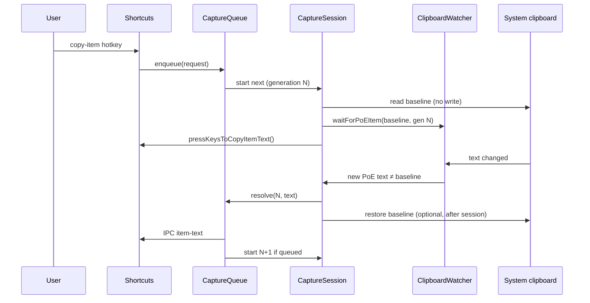

# Clipboard capture improvements

Design and implementation plan for replacing the current ad-hoc clipboard poll in item capture with a **serialized capture session** model.

## Motivation

The current `HostClipboard.readItemText()` flow has several failure modes documented in [Item capture](/item-capture) and discussed in recent debugging:

| Problem | Current cause |
| ------- | ------------- |
| Wrong item on rapid hotkeys | Concurrent calls share one `pollPromise` |
| Stale item from clipboard history | Poller accepts first PoE-shaped text, even if it was not produced by the latest copy |
| Fights with clipboard managers | Pre-poll `writeText("")` and mid-capture restore writes |
| Missed captures on Linux/Wayland | Fixed 48 ms poll may be too slow or too noisy depending on compositor |

## Proposed techniques

This redesign combines five ideas:

1. **[Event-driven clipboard watching (where possible)](./02-event-driven-clipboard.md)** — react to clipboard changes instead of blind polling; platform-specific fallbacks.
2. **[Generation counter](./03-capture-session-model.md#generation-counter)** — each capture attempt gets a monotonic session id; stale async results are ignored.
3. **[Serialize captures](./03-capture-session-model.md#serialized-capture-queue)** — one active capture at a time; rapid hotkeys queue instead of sharing one promise.
4. **[Defer clear](./03-capture-session-model.md#defer-clear)** — do not wipe the clipboard at session start; narrow the clear window to just before the simulated copy.
5. **[Skip restore during capture](./03-capture-session-model.md#skip-restore-during-capture)** — no `writeText` while waiting for item text; restore only after the session ends.

## Documents

| Doc | Contents |
| --- | -------- |
| [01 — Current behavior](./01-current-behavior.md) | Baseline code paths and constraints |
| [02 — Event-driven clipboard](./02-event-driven-clipboard.md) | Platform matrix (Windows, Linux, macOS); hybrid watcher design |
| [03 — Capture session model](./03-capture-session-model.md) | Queue, generation counter, defer clear, skip restore |
| [04 — Implementation checklist](./04-implementation-checklist.md) | File-by-file tasks, phases, tests, rollout |

## Target architecture (summary)

## Out of scope (this plan)

- Replacing clipboard capture with OCR or memory reading
- Changing `parseClipboard()` or trade query building
- Renderer-side changes (IPC payload stays compatible; optional debug fields only)

## Related docs

- [Item capture from the game](/item-capture)
- [Architecture — Shortcuts and clipboard](/architecture#shortcuts-and-input)
