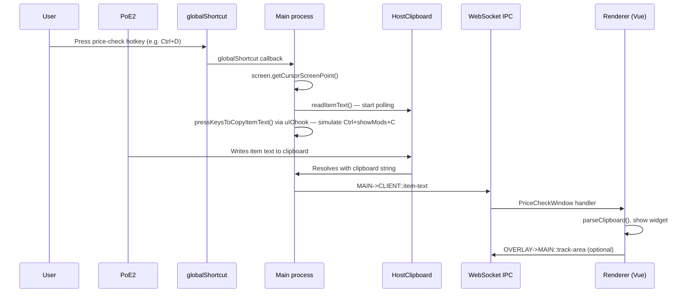

# Item capture from the game

Exiled Exchange 2 does **not** read game memory or inject into the PoE2 process. All item data comes from the same mechanism a player would use manually: **hover an item in-game and copy its text to the clipboard** (`Ctrl+C`, optionally with the game's "advanced item descriptions" modifier).

The application automates that copy on a hotkey, captures the **cursor position** at the moment of the press, polls the system clipboard until PoE2 writes item text, then delivers the result to the renderer over IPC. Widgets use the cursor position to decide **where on screen** to show results.

This document traces that pipeline end to end: hotkey → simulated copy → clipboard → overlay display.

## Overview



| Stage | Component | Responsibility |
| ----- | --------- | -------------- |
| Window attachment | `GameWindow`, `OverlayWindow` | Transparent overlay aligned to the PoE2 window |
| Input | `Shortcuts` | Register hotkeys; simulate copy; read cursor |
| Clipboard | `HostClipboard` | Poll until item text appears; optionally restore prior clipboard |
| Transport | `server.ts` WebSocket | Deliver `item-text` event to renderer |
| Display | `OverlayWindow.vue`, widgets | Show/hide UI; position panels from cursor |
| Parsing | `parseClipboard()` | Turn clipboard text into `ParsedItem` (separate from capture) |

## Game window and overlay attachment

Before any capture works, the main process must find the PoE2 window and attach a transparent overlay on top of it.

**`GameWindow`** (`main/src/windowing/GameWindow.ts`) wraps [`electron-overlay-window`](https://github.com/SnosMe/electron-overlay-window):

- `attach(window, title)` calls `OverlayController.attachByTitle()` with the configured window title (default `"Path of Exile 2"`).
- Focus events (`focus` / `blur`) drive `isActive`, which controls whether game hotkeys are registered.
- `bounds` exposes the game window rectangle; `screenshot()` captures pixels for OCR.
- `uiSidebarWidth` estimates the in-game left panel width (used for stash-area detection).

**`OverlayWindow`** (`main/src/windowing/OverlayWindow.ts`) creates the Electron `BrowserWindow` that hosts the Vue UI:

- Uses `OVERLAY_WINDOW_OPTS` for transparency and click-through behavior.
- **`isInteractable`** toggles between overlay mode (UI clickable) and game mode (clicks pass through to PoE2).
- The **overlay key** (default `Shift + Space`) toggles this state.

When the game gains focus, `handlePoeWindowActiveChange` forces `isInteractable = false` and broadcasts `MAIN->OVERLAY::focus-change` so the renderer knows the overlay is in "game mode."

### Overlay key vs `toggle-overlay` shortcut

Two separate mechanisms toggle overlay interactability:

| Mechanism | Default | Registration | Code path |
| --------- | ------- | ------------ | --------- |
| **Overlay key** | `Shift + Space` | Always on the overlay window | `OverlayWindow.handleExtraCommands` (`before-input-event`) |
| **`toggle-overlay` action** | User-configurable in Shortcuts | `globalShortcut` while game focused | `Shortcuts.register()` |

Price-check and other capture hotkeys are unrelated to either — they use `globalShortcut` and only fire while the game window is focused.

## Hotkey configuration

Hotkeys are **not** hard-coded in the main process. The renderer builds a `ShortcutAction[]` from user settings and sends it via `CLIENT->MAIN::update-host-config` on startup and whenever settings change.

`getConfigForHost()` in `renderer/src/web/Config.ts` is the central mapping. Relevant `copy-item` actions:

| Setting | Default | `target` | `focusOverlay` |
| ------- | ------- | -------- | ---------------- |
| `hotkeyHold + hotkey` | `Ctrl + D` | `price-check` | `false` |
| `hotkeyLocked` | `Ctrl + Alt + D` | `price-check` | `true` |
| Item check hotkey | — | `item-check` | `true` |
| Wiki / PoE2DB / Craft of Exile keys | — | `open-wiki`, etc. | — |
| Library log-item key | — | `log-item` | — |

Each `copy-item` action becomes:

```ts
{
  shortcut: "Ctrl + D",
  keepModKeys: true,  // price-check normal hotkey only
  action: {
    type: "copy-item",
    target: "price-check",
    focusOverlay: false,
  },
}
```

`keepModKeys: true` means modifier keys from the user's hotkey stay held while the simulated copy runs (see [Simulated key presses](#simulated-key-presses)).

Reserved shortcuts used by the game (`Ctrl+C`, `Ctrl+V`, arrow keys, etc.) are filtered out and logged as errors if configured.

## Hotkey registration and activation

**`Shortcuts`** (`main/src/shortcuts/Shortcuts.ts`) registers hotkeys only while the **game window is focused**:

```
game focused  → register()  → globalShortcut.register(...)
game blurred  → unregister() → globalShortcut.unregisterAll()
```

If the game loses focus (Alt+Tab, clicking outside PoE2), **all capture hotkeys stop working** until focus returns. This is a common cause of "nothing happens" reports.

When a registered shortcut fires:

1. **Release hotkey keys** — uIOhook toggles each key in the shortcut to `up`, so they do not interfere with the simulated copy (with a macOS exception for `keepModKeys`).
2. **Branch on action type** — for `copy-item`, run the capture pipeline below.

Other action types (`toggle-overlay`, `paste-in-chat`, `stash-search`, `trigger-event`, `ocr-text`) follow separate code paths.

## Simulated key presses

PoE2 copies item text when the player presses `Ctrl+C` while hovering an item. If the in-game **"Show Advanced Item Descriptions"** key is held (default `Alt`), the copy includes full modifier tiers and ranges.

EE2 reads that binding from the game's config file:

**`GameConfig`** (`main/src/host-files/GameConfig.ts`) parses `poe2_production_Config.ini`:

```
[ACTION_KEYS]
show_advanced_item_descriptions = 18       → "Alt" (key code 18 = Alt, no modifier)
show_advanced_item_descriptions = 18 2     → "Ctrl + Alt" (modifier 2 = Ctrl)
```

PoE stores the main key as a numeric code and an optional modifier suffix (`1` = Shift, `2` = Ctrl, `3` = Alt). See `GameConfig.parseConfigHotkey()` and `ipc/KeyToCode.ts`.

Search paths include Documents, Steam Proton prefixes (app ID `2694490`), and macOS Application Support. The parsed key becomes `showModsKey` (defaults to `"Alt"` if not found).

**`pressKeysToCopyItemText()`** merges the game's show-mods key with `Ctrl+C`:

```ts
let keys = mergeTwoHotkeys("Ctrl + C", showModsKey).split(" + ");
// e.g. "Ctrl + Alt + C" → press Ctrl down, Alt down, tap C, release Alt, release Ctrl
```

Platform behavior:

- **Windows / Linux** — modifier keys already held by the user's hotkey are **not** pressed again (avoids double-toggle).
- **macOS** — already-held modifiers **are** toggled; required for advanced descriptions to copy correctly with hotkeys like `Alt + X`.

A **10 ms timeout** before key release prevents the game from dropping release events under load.

EE2 also registers the merged `Ctrl + <showModsKey> + C` shortcut as `test-only` and immediately unregisters it. This prevents the OS from treating that exact combo as exclusively EE2's, so the game can still receive it when EE2 simulates it.

## Clipboard polling

**`HostClipboard.readItemText()`** (`main/src/shortcuts/HostClipboard.ts`) runs **in parallel** with the simulated key press:

1. **Snapshot** current clipboard text. If it already looks like a PoE item, clear it (avoids stale data).
2. **Poll every 48 ms** (up to 500 ms total) until clipboard text matches a known item header.
3. **Resolve** with the item text, or reject on timeout.

Item detection uses the first line of the clipboard:

| Language | First line prefix |
| -------- | ----------------- |
| English | `Item Class: ` |
| Russian | `Класс предмета: ` |
| German | `Gegenstandsklasse: ` |
| … | (all supported client languages) |

If **Restore clipboard** is enabled in settings, the pre-copy clipboard content is written back after a successful read (or on timeout). A 120 ms window in `restoreShortly()` ensures PoE2 reads the clipboard before restoration — restoring too early could paste a password or unrelated text into the game.

Concurrent `readItemText()` calls share one poll promise so rapid hotkey presses do not start competing polls.

## Cursor position capture

At the **instant** the hotkey callback runs — before the simulated copy — the main process records:

```ts
const pressPosition = screen.getCursorScreenPoint();
// { x: number, y: number } in screen coordinates
```

This position is included in the `MAIN->CLIENT::item-text` payload. It represents where the user was pointing in the game when they triggered the check, not where the overlay widget ends up.

Uses of `pressPosition`:

| Consumer | Use |
| -------- | --- |
| `PriceCheckWindow` | Stash vs inventory side layout; price panel screen region for area tracking |
| `CheckPositionCircle` | Visual ring at the click point (when `showCursor` is enabled) |
| `WidgetItemCheck` | Anchor widget to left or right side of overlay |
| `ReloadTradeData` fallback | Re-trigger capture at the same position |

### Stash vs inventory heuristic

The renderer compares the click X coordinate to the horizontal center of the overlay window:

```ts
checkPosition.x > window.screenX + window.innerWidth / 2
  ? "inventory"   // right side of screen
  : "stash"     // left side (near stash panel)
```

`PriceCheckWindow` uses this to pick `flex-row` vs `flex-row-reverse`, placing the 28.75 rem price panel on the opposite side from the hovered item so it does not cover the tooltip.

The in-game left panel width is approximated as `986 / 1600 * windowHeight` CSS pixels (`poePanelWidth` in `OverlayWindow.vue`).

**Limitations:** this is a screen-center heuristic, not actual game UI layout. Ultrawide monitors, scaled UI, or stash open on the right can place the price panel on the wrong side. There is no pixel-perfect stash-panel detection for price-panel placement today.

Separately, the main process uses a **game-window-based** `isStashArea()` in `Shortcuts.ts` (window bounds + estimated left-panel width) for stash-scroll hotkeys — that logic is more precise but is not used for price-check layout.

## IPC delivery

On successful clipboard read, the main process sends:

```ts
{
  name: "MAIN->CLIENT::item-text",
  payload: {
    target: "price-check",      // routes to the correct widget handler
    clipboard: "Item Class: ...\nRarity: ...\n...",
    position: { x, y },         // screen coordinates from getCursorScreenPoint()
    focusOverlay: false,        // true for "locked" / advanced-check hotkeys
  },
}
```

Delivery target is `last-active` WebSocket client (the overlay, or browser tab in `--no-overlay` mode).

If `focusOverlay && overlay.wasUsedRecently`, the main process also calls `overlay.assertOverlayActive()` so the user can interact with the price-check UI without pressing the overlay key first.

`WidgetAreaTracker.removeListeners()` is called before sending — a new capture cancels any previous mouse-tracking session.

## Renderer handling by target

Each widget (or action module) subscribes to `MAIN->CLIENT::item-text` and filters on `e.target`:

### `price-check` — `PriceCheckWindow.vue`

1. Ignore if `e.target !== "price-check"`.
2. If running in Electron and `!e.focusOverlay`, send `OVERLAY->MAIN::track-area` (see [Area tracking](#area-tracking-keeping-the-widget-open)).
3. `wm.show(wmId)` — set `wmWants = "show"` on the price-check widget.
4. Store `checkPosition` and `advancedCheck` (`focusOverlay`).
5. `handleItemPaste()` → `parseClipboard(e.clipboard)` → `ParsedItem` or error.
6. On success, queue poe.ninja price fetches.

The price-check widget is created with `wmZorder: "exclusive"` and `wmFlags: ["hide-on-blur", "menu::skip"]`, so it takes over the overlay while visible and hides when focus returns to the game.

### `item-check` — `WidgetItemCheck.vue`

Parses clipboard, shows map check or item info widget. Positions via `anchor` computed from click side (stash left / inventory right).

### `log-item` — `SingleItemSession.vue`

Parses clipboard during an active library session and diffs modifiers for CSV logging. Does not show a capture overlay.

### `open-wiki`, `open-poedb`, etc. — `hotkeyable-actions.ts`

Parses clipboard and opens an external URL or triggers stash search. No overlay widget.

## Overlay display mechanics

### Widget visibility state machine

`OverlayWindow.vue` provides a `WidgetManager` to all child widgets:

| Method | Effect |
| ------ | ------ |
| `show(wmId)` | `wmWants = "show"`, bring to top; hides other exclusive widgets |
| `hide(wmId)` | `wmWants = "hide"` |
| `setFlag(wmId, flag, state)` | Toggle behavioral flags |

`isVisible(wmId)` combines:

- `wmWants === "show"`
- Exclusive widget rules (only one exclusive widget visible at a time)
- `hide-on-blur` / `hide-on-focus` / `invisible-on-blur` flags
- Global UI visibility (`OverlayVisibility` — see below)
- `active` state (whether overlay is interactable)

### Pointer events layering

`PriceCheckWindow` root uses `pointer-events-none` on the full-screen container so clicks pass through to the game except on explicit panels (`pointer-events-auto` on the price panel, item editor, related items, etc.).

### Focus and blur behavior

`MAIN->OVERLAY::focus-change` updates `active` and `gameFocused`:

- When `active === false` (game focused), widgets with `hide-on-blur` are hidden.
- When `active === true` (overlay interactable), widgets with `hide-on-focus` are hidden.

Price check uses `hide-on-blur`: releasing the overlay key or clicking back into the game closes the price window.

### Overlay visibility (Alt-key peek)

**`OverlayVisibility`** (`main/src/windowing/OverlayVisibility.ts`) temporarily hides the entire overlay UI when the user holds **Alt** alone (matching the default show-mods key):

- After 85 ms (overlay interactable) or 275 ms (game mode), sends `MAIN->OVERLAY::visibility { isVisible: false }`.
- Releasing Alt or moving the mouse restores visibility.

This lets players see the game underneath while holding Alt for advanced item descriptions.

### Area tracking (keeping the widget open)

For the normal price-check hotkey (`focusOverlay: false`), the overlay stays in **click-through mode** while the price panel is shown. The user can keep playing without toggling the overlay key.

**`WidgetAreaTracker`** (`main/src/windowing/WidgetAreaTracker.ts`) implements "move mouse away to close":

1. Renderer sends `OVERLAY->MAIN::track-area` with:
   - `from` — original click position (DIP / scaled per platform)
   - `area` — screen rectangle of the price panel
   - `closeThreshold` — `2.5 * fontSize` pixels
   - `holdKey` — `hotkeyHold` (e.g. `Ctrl`); holding this modifier suppresses auto-close
   - `dpr` — device pixel ratio for coordinate conversion

2. uIOhook listens for `mousemove` and `mousedown`:
   - If cursor moves farther than `closeThreshold` from `from` (without hold key), send `MAIN->OVERLAY::hide-exclusive-widget`.
   - If cursor enters the price panel area, call `overlay.assertOverlayActive()` so the user can click UI controls.
   - If overlay is already interactable and cursor leaves the panel, return focus to game.

Platform-specific coordinate scaling handles Windows DPI, Linux multi-monitor scale factors, and macOS native coordinates.

### Visual click indicator

When `showCursor` is enabled and the overlay is interactable, `CheckPositionCircle.vue` renders a translucent ring centered on `position`, converted from screen to overlay-local CSS:

```ts
top:  calc(${position.y - window.screenY}px - 2.5rem)
left: calc(${position.x - window.screenX}px - 2.5rem)
```

## Advanced check (`focusOverlay: true`)

The **locked** hotkey (default `Ctrl + Alt + D`) sets `focusOverlay: true`:

- Skips `track-area` registration.
- Sets `advancedCheck = true` in the price-check widget, which switches initial search strategy (`lockedInitialSearch` vs `smartInitialSearch` in `CheckedItem.vue`).
- Activates the overlay if it was recently used, so filters and listings are immediately clickable.

This mode is for deliberate trade searches where the user expects to interact with the overlay UI.

## Alternative capture: OCR

Not all features use the clipboard. The **Heist gem OCR** action (`ocr-text` → `heist-gems`, Windows only):

1. `poeWindow.screenshot()` captures the full game window bitmap.
2. `OcrWorker` (worker thread + Comlink) runs text recognition.
3. Results arrive as `MAIN->CLIENT::ocr-text` with `paragraphs[]`.

No cursor position or clipboard is involved.

## Configuration reference

| Setting | Location | Effect on capture |
| ------- | -------- | ----------------- |
| Price-check hotkey / hold / locked | Settings → Shortcuts | Registers `copy-item` actions |
| Window title | Settings → General | Game window matching for overlay attach |
| Restore clipboard | Settings → General | `HostClipboard` restoration behavior |
| Show cursor | Settings → Price check | `CheckPositionCircle` visibility |
| Overlay key | Settings → General | Toggle interactable vs click-through |
| Overlay always close | Settings → General | Background click sends `focus-game` |
| Game config path | Settings → General | `showModsKey` for advanced descriptions |
| Font size | Settings → General | Price panel width and `closeThreshold` |

## Error cases

| Symptom | Cause | Log / behavior |
| ------- | ----- | -------------- |
| Nothing happens | Game not focused; hotkey not registered | All `globalShortcut` hotkeys unregister on blur |
| Nothing happens | Clipboard timeout (no item hovered) | `warn [ClipboardPoller] No item text found.` — UI stays silent (`catch(() => {})` in `Shortcuts.ts`) |
| Wrong item | Stale clipboard; previous item still copied | Cleared if detected before poll |
| No advanced mods | `showModsKey` mismatch with game settings | Copy lacks tier data; check `poe2_production_Config.ini` — see also [no stats when price checking](/no-item-mods) |
| Hotkey not registered | Conflict with game or another app | `error [Shortcuts] Failed to register...` |
| No overlay | PoE2 running as elevated admin (**Windows**) | Error dialog; EE2 needs equal elevation |
| Price panel wrong side | Click position heuristic | Based on screen center, not game UI layout |

## Source file index

| Topic | File |
| ----- | ---- |
| Hotkey registration & copy trigger | `main/src/shortcuts/Shortcuts.ts` |
| Clipboard polling | `main/src/shortcuts/HostClipboard.ts` |
| Game show-mods key | `main/src/host-files/GameConfig.ts` |
| Cursor → area tracking | `main/src/windowing/WidgetAreaTracker.ts` |
| Overlay focus / interactability | `main/src/windowing/OverlayWindow.ts` |
| Overlay hide on Alt | `main/src/windowing/OverlayVisibility.ts` |
| Game window attach | `main/src/windowing/GameWindow.ts` |
| Hotkey → action mapping | `renderer/src/web/Config.ts` (`getConfigForHost`) |
| IPC types | `ipc/types.ts` (`IpcItemText`) |
| Price check display | `renderer/src/web/price-check/PriceCheckWindow.vue` |
| Click position indicator | `renderer/src/web/price-check/CheckPositionCircle.vue` |
| Item check display | `renderer/src/web/item-check/WidgetItemCheck.vue` |
| Overlay widget shell | `renderer/src/web/overlay/OverlayWindow.vue` |
| Clipboard → ParsedItem | `renderer/src/parser/Parser.ts` (`parseClipboard`) |

## Related documentation

- [Architecture](/architecture) — overall system design
- [Development](/development) — local setup and extending widgets
- [No item mods](/no-item-mods) — missing advanced modifier tiers
- [Command-line options](/cmd-flags) — `--no-overlay` and other flags
